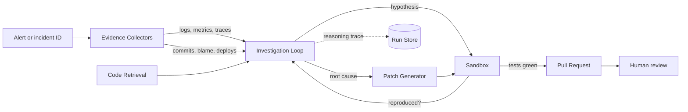

<div align="center">

# sev0

**An autonomous AI software engineer that diagnoses broken applications, repairs them, and proves the fix.**

[](https://github.com/Amirjon06/sev0/actions/workflows/ci.yml)
[](https://codecov.io/gh/Amirjon06/sev0)
[](https://www.python.org/downloads/)
[](LICENSE)
[](https://www.conventionalcommits.org)

</div>

---

## Table of Contents

- [What sev0 does](#what-sev0-does)
- [Why it exists](#why-it-exists)
- [How it works](#how-it-works)
- [Incident Lab](#incident-lab)
- [Prerequisites](#prerequisites)
- [Installation](#installation)
- [Quick Start](#quick-start)
- [Configuration](#configuration)
- [Safety model](#safety-model)
- [Project status](#project-status)
- [Contributing](#contributing)
- [License](#license)

---

## What sev0 does

**sev0 is an agent that takes the pager.** Point it at a production incident and
it investigates on its own — reading logs, metrics, traces, Git history, and
source code — until it can name a **root cause**, not just a symptom.

It then writes a patch, reproduces the failure in an **isolated sandbox**, runs
the test suite to confirm the fix holds and nothing else breaks, and opens a
**pull request** documenting every step of its reasoning.

A human never stops being the approver. What changes is the shape of the work:
from *two hours of 3am debugging* to *five minutes reviewing a written argument
with a diff and a passing test run attached*.

**Who it is for:** platform and SRE teams carrying an on-call rotation, and
engineers researching autonomous debugging agents who need a reproducible
harness rather than a demo video.

### Core capabilities

| Capability | What it means |
| --- | --- |
| **Evidence collection** | Queries Loki, Prometheus, and Tempo for the logs, metrics, and traces around the incident window |
| **History correlation** | Correlates the failure onset against recent commits, deploys, and config changes |
| **Code retrieval** | AST-aware search over the target repository to pull the functions actually implicated |
| **Hypothesis testing** | Forms candidate root causes and *tests* them in a sandbox instead of guessing once |
| **Patch generation** | Produces a minimal diff bounded by explicit file and line limits |
| **Verification** | Reproduces the original failure, applies the patch, and re-runs the suite to prove recovery |
| **Pull request authoring** | Opens a PR with the evidence trail, the rejected hypotheses, and the confidence level |
| **Scored evaluation** | Ships with [Incident Lab](#incident-lab), a benchmark that grades the agent against known ground truth |

---

## Why it exists

The market is full of tools that claim to resolve incidents autonomously. Almost
none of them publish **falsifiable evidence** that they work, because measuring
this properly is harder than building the agent.

sev0 treats that inversion seriously. The agent is the deliverable, but
**Incident Lab is the argument** — a fault-injection harness that breaks a real
microservice application in ways the agent is not told about, then scores the
outcome against ground truth the harness already knows.

Every claim in this README is meant to be reproducible on your own machine with
one command. Where a number is not yet measured, the roadmap says so.

---

## How it works



The investigation loop is deliberately **iterative, not linear**. sev0 forms a
hypothesis, tries to reproduce it in the sandbox, and feeds the result back in.
A hypothesis that fails to reproduce is recorded as **rejected** and appears in
the final pull request — the negative results are part of the evidence.

> **Demo**
> A recorded end-to-end run — alert to merged pull request — will be embedded
> here once Phase 3 lands. See [Project status](#project-status).

---

## Incident Lab

**Incident Lab** is the evaluation harness that makes the agent's performance a
number instead of an anecdote. It runs a containerized microservice application,
injects a hidden fault, and hands sev0 nothing but an alert.

Faults come in three families:

- **Code faults** — a bad commit is planted in history (off-by-one, unhandled
  null, wrong comparison operator, swapped arguments)
- **Config faults** — a timeout, connection pool size, or feature flag is set to
  a value that only fails under load
- **Infrastructure faults** — latency injection, packet loss, or resource
  starvation applied to one service

Each scenario carries **ground truth**: the exact commit, file, and line
responsible. The harness scores four metrics:

| Metric | Definition |
| --- | --- |
| **Root-cause accuracy** | Did the agent name the correct file and commit? |
| **Time to diagnosis** | Wall-clock seconds from alert to stated root cause |
| **Resolution rate** | Did the patch make the failing test pass without breaking others? |
| **Unsafe changes** | Count of edits touching protected paths or exceeding diff limits |

Run the full suite and get a scorecard:

```bash
sev0-lab run --suite core --output runs/
sev0-lab report runs/ --format markdown
```

---

## Prerequisites

| Requirement | Version | Notes |
| --- | --- | --- |
| **Python** | 3.11 or 3.12 | 3.13 is untested |
| **Docker** | 24.0+ | Required for the sandbox and Incident Lab |
| **Git** | 2.40+ | Required for history analysis |
| **Anthropic API key** | — | Get one at [console.anthropic.com](https://console.anthropic.com) |
| **GitHub token** | — | Fine-grained, with `Contents: read/write` and `Pull requests: read/write` |
| **RAM** | 8 GB free | Incident Lab runs six containers |

**Operating systems:** macOS 13+, Ubuntu 22.04+, and Windows 11 via WSL2.

---

## Installation

```bash
git clone https://github.com/Amirjon06/sev0.git
cd sev0

python -m venv .venv
source .venv/bin/activate          # Windows: .venv\Scripts\activate

pip install -e ".[dev]"
cp .env.example .env               # then add your API keys
```

Confirm the install:

```bash
sev0 doctor
```

`sev0 doctor` prints every resolved setting and flags anything missing. If it
renders a table, you are ready.

---

## Quick Start

### 1. Start Incident Lab and break something

```bash
sev0-lab up                                  # boots the demo app + observability stack
sev0-lab inject --scenario checkout-5xx      # plants a hidden fault
```

The demo storefront is now failing. sev0 has not been told what changed.

### 2. Turn the agent loose

```bash
sev0 investigate --incident checkout-5xx --dry-run
```

```text
[14:02:11] Collecting evidence ................ 412 log lines, 3 metrics, 18 traces
[14:02:29] Correlating 14 commits in window ... 2 candidates
[14:02:44] Hypothesis 1: connection pool exhaustion
[14:03:02]   ✗ not reproduced — pool utilization peaked at 34%
[14:03:05] Hypothesis 2: unhandled null in cart total
[14:03:31]   ✓ reproduced in sandbox — AttributeError at checkout/cart.py:88
[14:03:33] Root cause: commit a3f9c21 "Add promo code support"
[14:03:58] Patch generated ................... 1 file, 6 lines
[14:04:40] Tests: 128 passed, 0 failed        (was 3 failed)

  Root cause     checkout/cart.py:88   confidence high
  Time to fix    2m 29s
  Diff size      1 file / 6 lines      within limits
  Dry run        no pull request opened
```

### 3. Let it open the pull request

```bash
sev0 investigate --incident checkout-5xx --no-dry-run
```

### 4. Score it

```bash
sev0-lab score --scenario checkout-5xx
```

```text
Root-cause accuracy   correct  (a3f9c21 / checkout/cart.py)
Time to diagnosis     80s
Resolution            passed
Unsafe changes        0
```

---

## Configuration

All configuration is read from environment variables or a local `.env` file.
Copy `.env.example` and edit. **Never commit `.env`.**

| Variable | Default | Purpose |
| --- | --- | --- |
| `ANTHROPIC_API_KEY` | — | **Required.** Model provider credential |
| `SEV0_MODEL` | `claude-sonnet-4-6` | Model backing the investigation loop |
| `GITHUB_TOKEN` | — | Required only for pull request creation |
| `SEV0_REPO` | — | Target repository as `owner/name` |
| `SEV0_LOKI_URL` | `http://localhost:3100` | Log source |
| `SEV0_PROMETHEUS_URL` | `http://localhost:9090` | Metrics source |
| `SEV0_TEMPO_URL` | `http://localhost:3200` | Trace source |
| `SEV0_SANDBOX_NETWORK` | `none` | Network mode for reproduction containers |
| `SEV0_MAX_FILES_CHANGED` | `5` | Hard cap on patch breadth |
| `SEV0_MAX_LINES_CHANGED` | `120` | Hard cap on patch size |
| `SEV0_MAX_TOOL_CALLS` | `60` | Budget per investigation |
| `SEV0_REQUIRE_HUMAN_APPROVAL` | `true` | Blocks merging without a human |
| `SEV0_PROTECTED_PATHS` | `migrations/,infra/,.github/` | Paths the agent may never edit |
| `SEV0_RUN_DIR` | `./runs` | Where reasoning traces are written |

---

## Safety model

An agent that edits code and opens pull requests needs limits that are **not
negotiable by the model**. sev0 enforces them outside the loop:

- **Sandboxed execution.** All generated code runs in a container with no network
  access by default and a hard wall-clock timeout.
- **Bounded diffs.** Patches exceeding the file or line caps are rejected before
  a pull request is ever created.
- **Protected paths.** Migrations, infrastructure, and CI configuration are
  read-only to the agent.
- **Human in the loop.** sev0 opens pull requests. It does not merge them, and it
  never pushes to a default branch.
- **Full auditability.** Every run writes its complete tool-call trace,
  hypotheses, and rejections to `runs/<run-id>/`.

---

## Project status

sev0 is **under active development** and not yet production-ready. The roadmap
is tracked in [docs/ROADMAP.md](docs/ROADMAP.md).

| Phase | Scope | Status |
| --- | --- | --- |
| **1** | Incident Lab: demo app, observability stack, fault injection | In progress |
| **2** | Evidence collectors and the investigation loop | Planned |
| **3** | Patch generation, sandbox verification, pull requests | Planned |
| **4** | Scored benchmark suite and published results | Planned |

Benchmark numbers will be published here as soon as Phase 4 produces them. Until
then, no accuracy claims are made.

---

## Contributing

Contributions are welcome. Read [CONTRIBUTING.md](CONTRIBUTING.md) for the branch
naming, the Conventional Commits format, and what a reviewable pull request looks
like.

Open an issue before starting significant work so the approach can be discussed
first.

---

## License

Distributed under the MIT License. See [LICENSE](LICENSE) for the full text.
