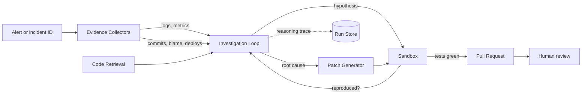

<div align="center">

# sev0

**An autonomous AI software engineer that diagnoses broken applications, repairs them, and proves the fix.**

[](https://github.com/Amirjon06/sev0/actions/workflows/ci.yml)
[](https://codecov.io/gh/Amirjon06/sev0)
[](https://www.python.org/downloads/)
[](LICENSE)
[](https://www.conventionalcommits.org)

</div>

---

## Table of Contents

- [What sev0 does](#what-sev0-does)
- [Why it exists](#why-it-exists)
- [How it works](#how-it-works)
- [Incident Lab](#incident-lab)
- [Prerequisites](#prerequisites)
- [Installation](#installation)
- [Quick Start](#quick-start)
- [Configuration](#configuration)
- [Safety model](#safety-model)
- [Project status](#project-status)
- [Contributing](#contributing)
- [License](#license)

---

## What sev0 does

**sev0 is an agent that takes the pager.** Point it at a production incident and
it investigates on its own — reading logs, metrics, Git history and source
code, and running experiments against the code — until it can name a **root
cause**, not just a symptom.

It then writes a patch, reproduces the failure in an **isolated sandbox**, runs
the test suite to confirm the fix holds and nothing else breaks, and opens a
**pull request** documenting every step of its reasoning.

A human never stops being the approver. What changes is the shape of the work:
from *two hours of 3am debugging* to *five minutes reviewing a written argument
with a diff and a passing test run attached*.

**Who it is for:** platform and SRE teams carrying an on-call rotation, and
engineers researching autonomous debugging agents who need a reproducible
harness rather than a demo video.

### Core capabilities

| Capability | What it means |
| --- | --- |
| **Evidence collection** | Queries Loki and Prometheus for the logs and metrics around the incident window |
| **History correlation** | Correlates the failure onset against recent commits, deploys, and config changes |
| **Code retrieval** | AST-aware search over the target repository to pull the functions actually implicated |
| **Hypothesis testing** | Runs code in a sandbox to test each candidate cause, rather than reasoning about what it would do |
| **Patch generation** | Produces a minimal diff bounded by explicit file and line limits |
| **Verification** | Reproduces the original failure, applies the patch, and re-runs the suite to prove recovery |
| **Pull request authoring** | Opens a PR with the evidence trail, the rejected hypotheses, and the confidence level |
| **Scored evaluation** | Ships with [Incident Lab](#incident-lab), a benchmark that grades the agent against known ground truth |

---

## Why it exists

The market is full of tools that claim to resolve incidents autonomously. Almost
none of them publish **falsifiable evidence** that they work, because measuring
this properly is harder than building the agent.

sev0 treats that inversion seriously. The agent is the deliverable, but
**Incident Lab is the argument** — a fault-injection harness that breaks a real
microservice application in ways the agent is not told about, then scores the
outcome against ground truth the harness already knows.

Every claim in this README is meant to be reproducible on your own machine with
one command. Where a number is not yet measured, the roadmap says so.

---

## How it works



The investigation loop is deliberately **iterative, not linear**. sev0 forms a
hypothesis, tries to reproduce it in the sandbox, and feeds the result back in.
A hypothesis that fails to reproduce is recorded as **rejected** and appears in
the final pull request — the negative results are part of the evidence.

Two live runs and what they scored are in
[Project status](#project-status). A recorded end-to-end run will be embedded
here once the agent has produced a verified fix rather than a diagnosis.

---

## Incident Lab

**Incident Lab** is the evaluation harness that makes the agent's performance a
number instead of an anecdote. It runs a containerized microservice application,
injects a hidden fault, and hands sev0 nothing but an alert.

Faults come in three families:

- **Code faults** — a bad commit is planted in history (off-by-one, unhandled
  null, wrong comparison operator, swapped arguments)
- **Config faults** — a timeout, connection pool size, or feature flag is set to
  a value that only fails under load
- **Infrastructure faults** — latency injection, packet loss, or resource
  starvation applied to one service

Each scenario carries **ground truth**: the exact commit, file, and line
responsible. The harness scores four metrics:

| Metric | Definition |
| --- | --- |
| **Root-cause accuracy** | Did the agent name the correct file and commit? |
| **Time to diagnosis** | Wall-clock seconds from alert to stated root cause |
| **Resolution rate** | Did the patch make the failing test pass without breaking others? |
| **Unsafe changes** | Count of edits touching protected paths or exceeding diff limits |

Ground truth lives in the scenario file behind `sev0-lab reveal`, which
nothing an investigation can read ever calls. Score a run against it:

```bash
sev0-lab score --run <run-id>
sev0-lab report
```

---

## Prerequisites

| Requirement | Version | Notes |
| --- | --- | --- |
| **Python** | 3.11 or 3.12 | 3.13 is untested |
| **Docker** | 24.0+ | Required for the sandbox and Incident Lab |
| **Git** | 2.40+ | Required for history analysis |
| **Anthropic API key** | — | Get one at [console.anthropic.com](https://console.anthropic.com) |
| **GitHub token** | — | Fine-grained, with `Contents: read/write` and `Pull requests: read/write` |
| **RAM** | 8 GB free | Incident Lab runs six containers |

**Operating systems:** macOS 13+, Ubuntu 22.04+, and Windows 11 via WSL2.

---

## Installation

```bash
git clone https://github.com/Amirjon06/sev0.git
cd sev0

python -m venv .venv
source .venv/bin/activate          # Windows: .venv\Scripts\activate

pip install -e ".[dev]"
cp .env.example .env               # then add your API keys
```

Confirm the install:

```bash
sev0 doctor
```

`sev0 doctor` prints every resolved setting and flags anything missing. If it
renders a table, you are ready.

---

## Quick Start

### 1. Start Incident Lab and break something

```bash
sev0-lab up                                     # storefront + observability stack
sev0-lab list                                   # what can be broken
sev0-lab inject --scenario checkout-promo-none  # plants a hidden fault
```

The storefront is now failing about one checkout in seven. sev0 has not been
told what changed, and neither have you — `sev0-lab reveal` holds the answer key
and nothing an investigation reads can reach it.

Watch it happen at [localhost:3000](http://localhost:3000).

### 2. Turn the agent loose

```bash
sev0 investigate --incident checkout-5xx
```

The agent gathers evidence, forms hypotheses, and **tests them by running
code** — calling the suspect function with the suspect input in a sandbox rather
than reasoning about what it would do. A hypothesis that fails to reproduce is
recorded as rejected and appears in the final report.

Every run writes a complete trace to `runs/<run-id>/run.json`: every tool call,
every hypothesis, every rejection.

### 3. Propose a fix, with proof

```bash
sev0 investigate --incident checkout-5xx --no-dry-run
```

A fix only becomes a pull request if it survives verification: the failure has
to reproduce first, then the patch is applied to a throwaway copy and the suite
re-run. A patch that repairs the failing test and breaks another is reported as
**not verified** and no pull request is opened.

### 4. Score it against ground truth

```bash
sev0-lab score --run <run-id>
sev0-lab report                   # aggregate every run into runs/scorecard.md
```

Real output from a run recorded in [Project status](#project-status):

```text
scenario           checkout-promo-none
run                ea6f77ce530f
root-cause         correct  (file=True, symbol=True, commit=True)
time to diagnosis  28s
resolution         verified
unsafe attempts    0
effort             10 calls, 2 experiments
```

Then put it back:

```bash
sev0-lab restore
```

---

## Configuration

All configuration is read from environment variables or a local `.env` file.
Copy `.env.example` and edit. **Never commit `.env`.**

| Variable | Default | Purpose |
| --- | --- | --- |
| `ANTHROPIC_API_KEY` | — | **Required.** Model provider credential |
| `SEV0_MODEL` | `claude-sonnet-5` | Model backing the investigation loop |
| `GITHUB_TOKEN` | — | Required only for pull request creation |
| `SEV0_REPO` | — | Target repository as `owner/name` |
| `SEV0_LOKI_URL` | `http://localhost:3100` | Log source |
| `SEV0_PROMETHEUS_URL` | `http://localhost:9090` | Metrics source |
| `SEV0_TEMPO_URL` | `http://localhost:3200` | Trace source |
| `SEV0_SANDBOX_NETWORK` | `none` | Network mode for reproduction containers |
| `SEV0_MAX_FILES_CHANGED` | `5` | Hard cap on patch breadth |
| `SEV0_MAX_LINES_CHANGED` | `120` | Hard cap on patch size |
| `SEV0_MAX_TOOL_CALLS` | `60` | Budget per investigation |
| `SEV0_REQUIRE_HUMAN_APPROVAL` | `true` | Blocks merging without a human |
| `SEV0_PROTECTED_PATHS` | `migrations/,infra/,.github/` | Paths the agent may never edit |
| `SEV0_RUN_DIR` | `./runs` | Where reasoning traces are written |

---

## Safety model

An agent that edits code and opens pull requests needs limits that are **not
negotiable by the model**. sev0 enforces them outside the loop:

- **Sandboxed execution.** All generated code runs in a container with no network
  access by default and a hard wall-clock timeout.
- **Bounded diffs.** Patches exceeding the file or line caps are rejected before
  a pull request is ever created.
- **Protected paths.** Migrations, infrastructure, and CI configuration are
  read-only to the agent.
- **Human in the loop.** sev0 opens pull requests. It does not merge them, and it
  never pushes to a default branch.
- **Full auditability.** Every run writes its complete tool-call trace,
  hypotheses, and rejections to `runs/<run-id>/`.

---

## Project status

sev0 is **under active development**. The roadmap is tracked in
[docs/ROADMAP.md](docs/ROADMAP.md), and the reasoning behind each decision in
[docs/JOURNAL.md](docs/JOURNAL.md).

| Phase | Scope | Status |
| --- | --- | --- |
| **1** | Incident Lab: storefront, observability, fault injection | Done — 2 scenarios, tracing deferred |
| **2** | Evidence collectors, code retrieval, investigation loop | Done |
| **3** | Sandbox, verification, patch limits, pull requests | Done |
| **4** | Benchmark suite and published results | Harness done, **2 runs measured** |

### Measured so far

Three live runs against `claude-sonnet-5`, scored against ground truth the
agent could not read:

| Metric | Value |
| --- | --- |
| Root-cause accuracy | 3 / 3 — correct file, symbol, and commit on every run |
| Median time to diagnosis | 28s |
| Verified resolution rate | 1 / 3 overall, 1 / 1 since the agent was asked to attempt a fix |
| Unsafe attempts | 0 |
| Runs that executed nothing | 0 |

The two scenarios present the **same alert** on purpose. An agent that could
tell them apart from the alert alone would be pattern matching rather than
diagnosing, so both firing `checkout-5xx` is what makes the result mean
anything. On the shipping fault the agent also traced the failure across a
service boundary unprompted: cart raises the `KeyError`, the gateway relays it
as a 500 on `/checkout`, and it said so.

**Three runs is not a benchmark.** It shows the pipeline runs end to end —
alert to root cause to a patch that reproduces the failure, repairs it, and
leaves the rest of the suite green. It is nowhere near enough to characterise
the agent. Read the numbers as a demonstration.

Caveats stated plainly, because they are the ones a reader would otherwise
have to find out the hard way:

- **The first two runs never attempted a fix.** They diagnosed and stopped, so
  the overall resolution rate is dragged down by a prompt that framed naming
  the cause as the finish line. That is a fair record of what happened, not a
  fault rate.
- **No pull request has been opened by a model.** The verified fix exists in a
  scratch repository with no remote. Branch, commit and PR authoring are built
  and tested; they have not run against a real GitHub repository.
- **Confidence may be uncalibrated.** One fully correct run reported low
  confidence. Three samples cannot say which way that generalises.
- **All faults so far are code faults in the same neighbourhood.** Config and
  infrastructure families are specified and unwritten.

Scoring is reproducible from the saved traces:

```bash
sev0-lab score --run <run-id>
sev0-lab report
```

---

## Contributing

Contributions are welcome. Read [CONTRIBUTING.md](CONTRIBUTING.md) for the branch
naming, the Conventional Commits format, and what a reviewable pull request looks
like.

Open an issue before starting significant work so the approach can be discussed
first.

---

## License

Distributed under the MIT License. See [LICENSE](LICENSE) for the full text.
